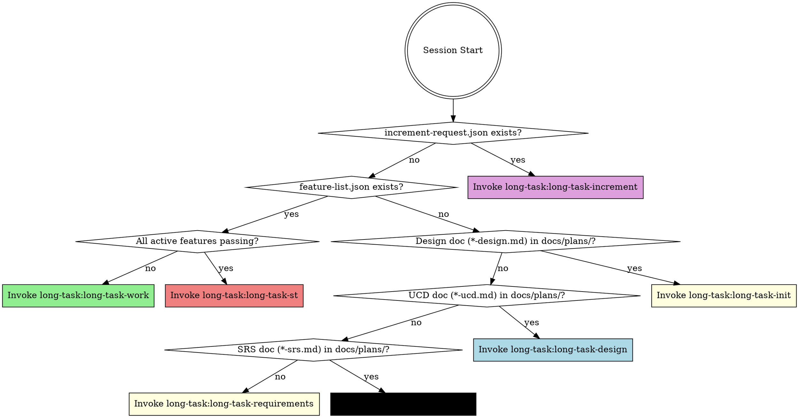

<EXTREMELY-IMPORTANT>
You are in a long-task multi-session project. You MUST invoke the correct phase skill BEFORE any response or action — including clarifying questions.

IF A PHASE SKILL APPLIES, YOU DO NOT HAVE A CHOICE. YOU MUST USE IT.

This is not negotiable. This is not optional. You cannot rationalize your way out of this.
</EXTREMELY-IMPORTANT>

## How to Access Skills

Use the `Skill` tool to invoke skills by name (e.g., `long-task:long-task-work`). When invoked, the skill content is loaded and presented to you — follow it directly. Never use the Read tool on skill files.

## Phase Detection

Check project state and invoke the corresponding skill:

**Detection rules:**
0. Check `increment-request.json` in project root → if exists → `long-task-increment` **(highest priority)**
1. Check `feature-list.json` in project root → if exists:
   - Run `python scripts/check_st_readiness.py feature-list.json` — if exit 0 (all active features passing, excludes deprecated) → `long-task-st`
   - Otherwise (some active features failing) → `long-task-work`
2. Check `docs/plans/*-design.md` → if any match → `long-task-init`
3. Check `docs/plans/*-ucd.md` → if any match → `long-task-design` (UCD done, proceed to design)
4. Check `docs/plans/*-srs.md` → if any match → `long-task-ucd` (SRS done, UCD next; if no UI features the UCD skill auto-skips to design)
5. Otherwise → `long-task-requirements`

## Skill Catalog

### Phase Skills (invoke ONE based on detection above)
| Skill | Phase | When |
|-------|-------|------|
| `long-task:long-task-increment` | Phase 1.5 | increment-request.json exists (highest priority) |
| `long-task:long-task-requirements` | Phase 0a | No SRS, no design doc, no feature-list.json |
| `long-task:long-task-ucd` | Phase 0b | SRS exists, no UCD doc, no design doc, no feature-list.json |
| `long-task:long-task-design` | Phase 0c | SRS + UCD exist (or no UI features), no design doc, no feature-list.json |
| `long-task:long-task-init` | Phase 1 | Design doc exists, no feature-list.json |
| `long-task:long-task-work` | Phase 2 | feature-list.json exists, some active features failing |
| `long-task:long-task-st` | Phase 3 | feature-list.json exists, ALL active features passing |

### Discipline Skills (invoked by long-task-work as sub-skills — do NOT invoke directly)
| Skill | Purpose |
|-------|---------|
| `long-task:long-task-feature-st` | Black-Box Feature Acceptance Testing — self-managed start/cleanup lifecycle, Chrome DevTools MCP execution, ISO/IEC/IEEE 29119 test case documentation (per-feature, after Quality Gates) |
| `long-task:long-task-tdd` | TDD Red-Green-Refactor |
| `long-task:long-task-quality` | Coverage Gate + Mutation Gate |
| `long-task:long-task-review` | Spec & Design Compliance Review |

## Harness Engineering

Long-task projects must treat the repository itself as the agent harness:

- If a workflow depends on oral context, Slack notes, dashboard spelunking, or a specific human, the harness is incomplete.
- If the same blocker, review comment, or diagnosis step appears more than once, stop and codify it as a repo-local harness asset before continuing.
- Prefer mechanical enforcement (lint rules, structural tests, contract tests, scripted checks) over advisory review comments.
- Keep harness artifacts current in the same commit that proves the old harness was stale.

Read on demand: `references/harness-engineering.md`

## Key Files (shared contract)

| File | Role |
|------|------|
| `docs/plans/*-srs.md` | Approved SRS — the WHAT |
| `docs/plans/*-ucd.md` | Approved UCD style guide — the LOOK (UI projects only) |
| `docs/plans/*-design.md` | Approved design — the HOW |
| `feature-list.json` | Task inventory — the central shared state |
| `task-progress.md` | `## Current State` header (progress) + session-by-session log |
| `long-task-guide.md` | Project-specific Worker guide |
| `env-guide.md` | Runtime lifecycle, reset, and health-check commands |
| `docs/runbooks/*.md` | Repo-local diagnosis and recovery procedures |
| `artifacts/` | Saved evidence bundles — logs, screenshots, traces, captures |
| `RELEASE_NOTES.md` | Living changelog |
| `docs/test-cases/feature-*.md` | Per-feature ST test case documents (ISO/IEC/IEEE 29119) |
| `docs/plans/*-st-report.md` | System testing report — Go/No-Go verdict |
| `increment-request.json` | Signal file — triggers incremental requirements (deleted after processing) |

## Red Flags

These thoughts mean STOP — you're rationalizing:

| Thought | Reality |
|---------|---------|
| "Let me just look at the code first" | Invoke phase skill first. It tells you HOW to orient. |
| "I know which feature to work on" | Worker skill has Orient step. Follow it. |
| "This feature is simple, skip TDD" | long-task-tdd is non-negotiable. |
| "Tests pass, I can mark it done" | long-task-quality gates MUST pass first. |
| "Code review is overkill for this" | long-task-review runs after EVERY feature. |
| "I remember the workflow" | Skills evolve. Load current version via Skill tool. |
| "I need more context first" | Skill check comes BEFORE exploration. |
| "I'll just do this one thing first" | Check BEFORE doing anything. |
| "Requirements are obvious, skip to design" | long-task-requirements captures what you'd miss. |
| "The SRS already implies the design" | SRS = WHAT, design = HOW. Both are needed. |
| "UI styles can be decided during coding" | Ad-hoc styling causes inconsistency. Run UCD first. |
| "This UI is too simple for a style guide" | Even simple UIs need tokens. UCD can be lightweight. |
| "All features pass, we can ship" | Feature tests ≠ system tests. Run ST phase first. |
| "System testing is overkill" | Integration bugs, NFR failures, and workflow gaps hide until ST. |
| "I'll just add features to the JSON directly" | Use `/long-task:increment` for tracked, audited changes. |
| "The requirement change is small, no need for impact analysis" | Increment skill catches hidden dependencies. |
| "I'll just ask the senior engineer which command to run" | If the repo does not say, the harness is missing. Write it down in-repo. |
| "Humans can keep checking the dashboard for this" | Manual dashboard inspection is a harness gap. Add a repo-local command or artifact flow. |
| "Review will catch boundary violations" | Encode boundary rules as mechanical checks where possible. |

## Skill Priority

1. **Phase skill first** — determines the entire session workflow
2. **Discipline skills second** — invoked by Worker in strict order (tdd → quality → st-case → review)
3. **On error** — follow systematic-debugging approach in `skills/long-task-work/references/systematic-debugging.md` before any fix
